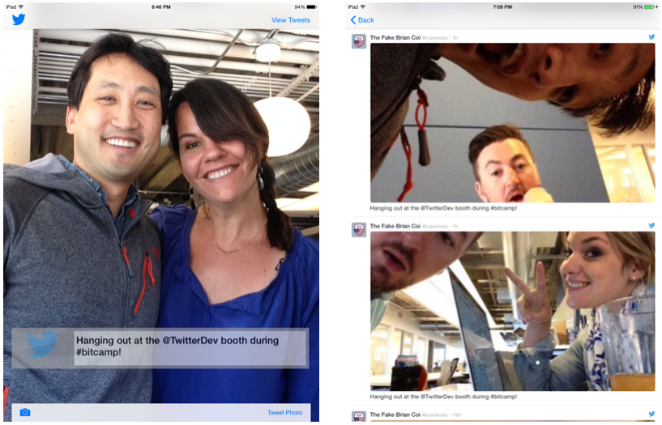

Twitter Photobooth Demo
===

This sample code will help you build with TwitterKit, Twitter's developer platform to enable Login with Twitter
and Tweet timeline display.

This example performs the following:

- Login with Twitter
- Take a photo and tweet it
- View recent Tweets of the logged in user

Requirements
---

- Fabric Mobile Developer Platform (http://fabric.io)
- TwitterKit iOS Libraries (Installable via Fabric executable, above)
- Swifter iOS Client Library (Included, also available at https://github.com/mattdonnelly/Swifter)

Configuration
---

As part of installing Fabric, Twitter app tokens will be generated automatically for you. There is no
need to go to apps.twitter.com to generate tokens.

Features
---

The enclosed sample includes three basic features:

- Login with Twitter (AuthViewController).
- Take photo and tweet it. (CameraViewController).
- Display a timeline of tweets post-photo. (TweetViewController).
- Settings (SettingsViewController).

Credits
---

The following developers and bloggers have aided greatly in the development of this source. I'm  appreciative of contributions and knowledge sharing.

- [@rchoi](https://twitter.com/rchoi)
- [@romainhuet](https://twitter.com/romainhuet)
- [@gpj](https://twitter.com/gpj)
